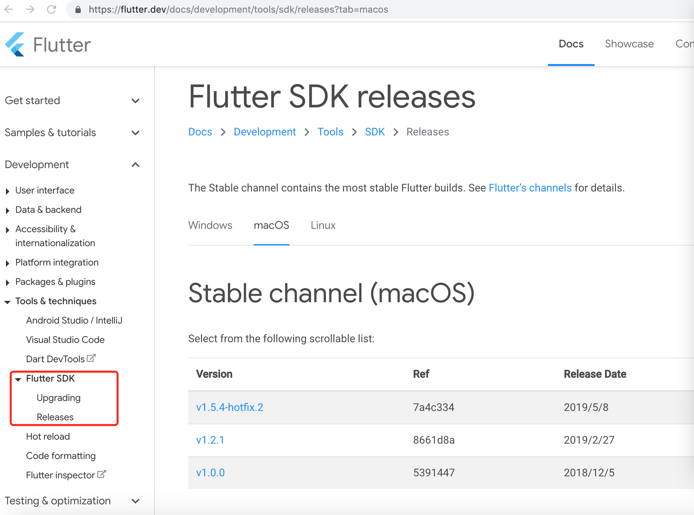
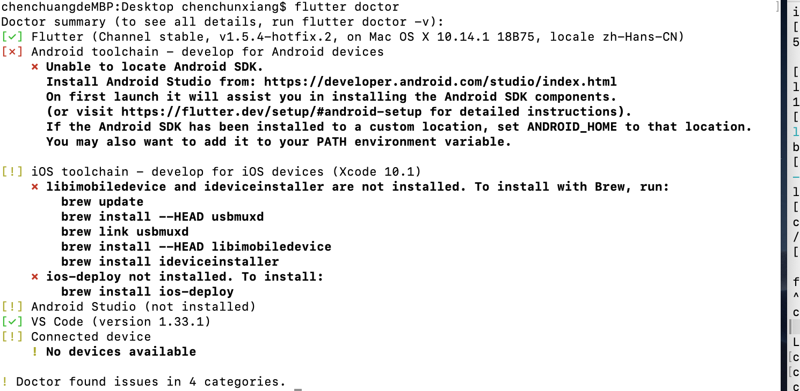

##### MAC配置flutetr开发环境

1. 下载flutter sdk。
    去flutter官网下载sdk包，[链接](https://flutter.dev/docs/development/tools/sdk/releases?tab=macos)，选择mac对应版本。可能需要梯子哦～
    
    <br>
    下载完成之后，将下载的sdk包解压到一个自己定义的文件夹中，记住改文件夹的路径。
    例如：
    > 在桌面新建一个code文件夹，将下载的包解压到code文件夹中，此时，路径地址为：～/code/flutter

    **配置环境变量**
    终端输入命令
    > vim ~/.bash_profile

    新增一个export path (这就用到路径地址)
    > export PATH=~/code/flutter/bin:$PATH

    然后重新加载一下.bash_profile
    > source ~/.bash_profile

    检测是否配置好
    ``` 
        flutter -h
    ```
    如输出flutter命令行帮助列表，则配置成功。

    这样配置了环境变量之后，可以在任何终端会话中运行flutter命令。
    -- --
    此外，还有一种安装sdk的方法，就是通过git下载flutter项目，我是去官网下载的，这里就不多提了～

    -- --
    环境变量配置好之后，在终端执行一下命令，查看flutter开发所需的东西，打勾的是已有的，打叉的需要更具要求安装，例如我的。
    ```
        flutter doctor 
    ```
    
    根据提示去完善～～～

    **安装Android SDK和AS**
    安装as就可以，安装完成之后，会自动下载android sdk.
    [AS下载地址](https://developer.android.com/studio?hl=zh_cn)
    下载完成之后，一顿傻瓜操作，有不明白的请参考其他文章。
    -- --
    安装AS完成之后
    **安装Flutter和Dart插件**
    需要安装两个插件:

    * Flutter插件： 支持Flutter开发工作流 (运行、调试、热重载等)。
    * Dart插件： 提供代码分析 (输入代码时进行验证、代码补全等)。
    
    安装步骤：

    1. 启动Android Studio。
    2. 打开插件首选项 (macOS：Preferences>Plugins, Windows：File>Settings>Plugins)。
    3. 选择 Browse repositories…，选择 flutter 插件并点击 install。
    4. 重启Android Studio后插件生效。

    
    